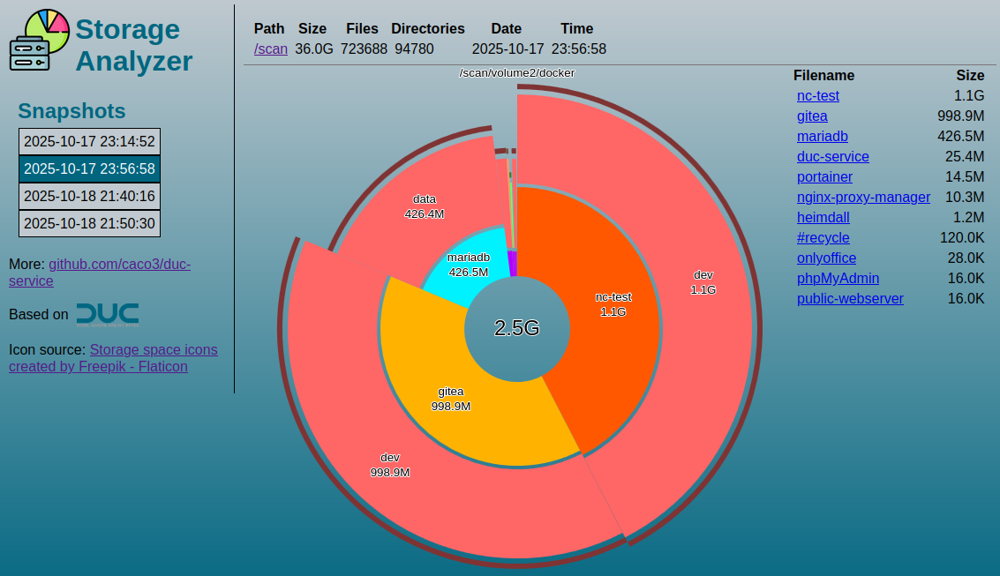

# Duc-Service
[](https://hub.docker.com/r/caco3x/duc-service/)
[](https://hub.docker.com/r/caco3x/duc-service/)
[](https://hub.docker.com/r/caco3x/duc-service/)
[](https://hub.docker.com/r/caco3x/duc-service/)

Run [Duc](https://duc.zevv.nl/) in Docker and re-index the file system using a schedule.
The results can be viewed in a webbrowser:



The built docker images can be found on [Docker Hub](https://hub.docker.com/r/caco3x/duc-service/).

# Features
- Included scheduling for automatic scanning
- Single-command deployment
- Very small image footprint
- Web UI to view each snapshot

## Usage Example
```
docker run -e "SCHEDULE=0 0 * * *" -p 80:80 \
    --mount type=bind,src=/,dst=/scan/root,readonly \
    --mount type=volume,src=duc_database,dst=/database \
    caco3x/duc-service
```

## Parameters
### SCHEDULE
A cron-expression that determines when an automatic scan is started.

## Web Endpoints
- `/index.htm` provides a web gui to explore the disk usage snapshots
- `/manual_scan.cgi` queues a manual scan
- `/log.cgi` displays the log output from the last scan

## Developing

### With docker-compose
Build:
```
docker-compose build
```

Run:
```
docker-compose up --build --detach
```

### Without docker-compose
Build:
```
docker build . -t duc-service
```

Run:
```
docker run -e "SCHEDULE=0 0 * * *" -p 80:80 \
    --mount type=bind,src=/,dst=/scan/root,readonly \
    --mount type=volume,src=duc_database,dst=/database \
    duc-service
```

## References
- Based on the work of https://github.com/MaximilianKoestler/duc-service
- Duc homepage: https://duc.zevv.nl/

## Similar Projects
- https://hub.docker.com/r/tigerdockermediocore/duc-docker
- https://hub.docker.com/r/digitalman2112/duc
